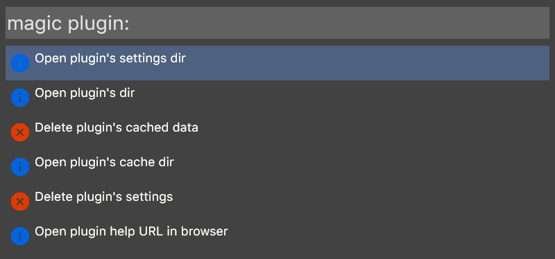

# nim-wox


Helper library for writing [Wox](http://getwox.com/) plugins in [Nim](http://nim-lang.org/)



## Contents

- [nim-wox](#nim-wox)
  - [Contents](#contents)
  - [Installation](#installation)
  - [Usage](#usage)
  - [Documentation](#documentation)
  - [Tests](#tests)
  - [Licensing](#licensing)

## Installation

`nimble install wox`

## Usage

```Nim
import browsers, json
import wox

proc query(wp: Wox, params: varargs[string]) =
  # create a global Wox object
  # add an item to Wox
  wp.add("Github", "How people build software", "Images\\gh.png",
          "openUrl", "https://github.com/", false)
  # send output to Wox
  echo wp.results()

proc openUrl(wp: Wox, params: varargs[string]) =
  # open url in default browser
  openDefaultBrowser(params[0])

when isMainModule:
  var wp = newWox("http://roose.github.io/nim-wox/wox.html")
  # register `query` and `openUrl` for call from Wox
  wp.register("query", query)
  wp.register("openUrl", openUrl)
  # run called proc
  wp.run()
```
**Attention:** `newWox` is generating `info.png` and `delete.png` in the `Images` folder(if they don't exist).

## Documentation

[Documentation](http://roose.github.io/nim-wox/wox.html)

## Tests

`nimble tests`

## Licensing

The code and documentation are released under the MIT Licence. See the bundled [LICENSE](https://github.com/roose/nim-wox/blob/master/LICENSE) file for details.